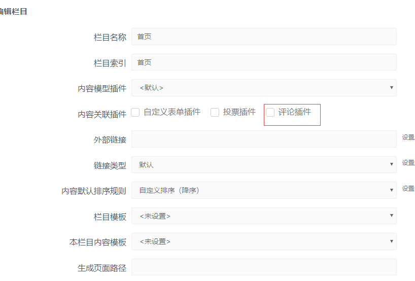

# 后台设置与启用

安装完毕评论插件后，我们就可以在后台开启评论信息了。

首先，我们需要先添加栏目用于保存招聘信息。

## 添加评论栏目

进入 SiteServer CMS 后台 **栏目管理** 界面，在页面底部点击 **快速添加** 按钮，进入添加栏目界面：



在 **内容模型插件** 下拉框中选择 **评论插件**，在下方的内容框中填写希望添加的栏目名称，点击确认按钮。

##模板STL标签调用
在内容模板里调用
```
 <stl:mycomment></stl:mycomment>
```

